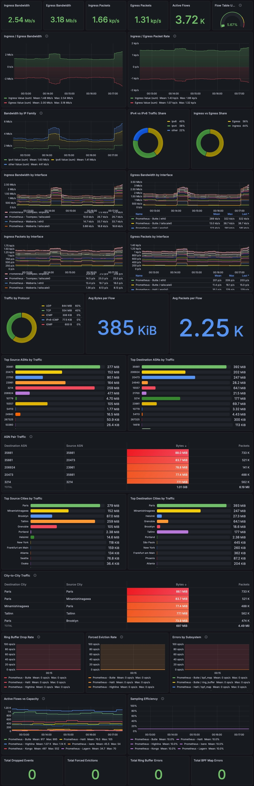

# RFM

RFM (Router Flow Monitor) is an eBPF-based network flow analysis agent for Linux
routers. It attaches TC programs to network interfaces, collects per-flow
traffic statistics with configurable sampling, optionally enriches flows from a
live BMP-fed RIB and/or MMDB ASN/city databases, and exports the results to
Prometheus and IPFIX.

Requirements:

- Linux 6.12 or newer (TCX, `bpf_ktime_get_boot_ns`)
- Go 1.23+
- Root or `CAP_BPF` + `CAP_NET_ADMIN`

Current scope:

- Attaches TC programs for bidirectional flow observation
- Parses ipv4 and ipv6 traffic on plain ethernet, VLAN, and QinQ links
- Keeps BPF behavior fully map-driven and stateless
- Optionally enriches flows in userspace with BMP/RIB data, MMDB data, or both
- Exports Prometheus metrics
- Optionally exports completed flows to one UDP IPFIX collector
- Ships a typed NixOS module and VM coverage

Planned:

- Unix socket control plane
- XDP firewall fast-path features

rfm runs as a single daemon (`rfm agent`) that loads eBPF programs, collects
flow events in userspace, and serves Prometheus metrics over HTTP.

```
+------------------------------------+
|            kernel                  |
|  TC ingress --+                    |
|               +---> ring buffer -----> userspace collector
|  TC egress  --+                    |
|                                    |
|  per-CPU iface stats map ------------> Prometheus /metrics
+------------------------------------+
```

BPF programs are attached via TCX as link-based attachments. BPF behavior is
map-driven: sampling rates and feature flags live in a shared `rfm_config` map
rather than compiled-in constants. The config map is writable at runtime, though
the current agent writes it during startup.

### Data path

1. TC programs classify each packet by direction, protocol family, and 5-tuple
   after ethernet, VLAN, and QinQ parsing. Every packet updates per-CPU
   interface counters. Sampled packets (1-in-N) emit a flow event to a ring
   buffer. IPv4 non-initial fragments keep the IP protocol but export
   `src_port=0` and `dst_port=0` because later fragments do not carry the
   transport header.
2. The userspace collector reads events from the ring buffer, converts
   `CLOCK_BOOTTIME` timestamps to wall clock time, and aggregates flows into an
   in-memory table keyed by
   `(ifindex, direction, protocol,
   src/dst address, src/dst port)`.
3. Flows are evicted after a configurable idle timeout. When the flow table is
   full, the oldest flow is forcibly evicted.
4. At scrape time, the Prometheus exporter reads the BPF interface counters map
   directly and iterates the flow table, rolling up flows by enrichment labels
   (ASN, city) before emitting metrics. With no enrichment configured, those
   labels stay empty and the agent still runs normally.
5. When IPFIX is enabled, completed flows are exported on eviction and agent
   shutdown. The exporter owns its UDP socket and excludes only that exact
   socket tuple from recursive self-export.

## Configuration

rfm reads a TOML config file (default `/etc/rfm/rfm.toml`). Unknown keys are
rejected at load time to catch typos. Example:

```toml
[agent]
interfaces = ["eth0", "tailscale0"]

[agent.bpf]
sample_rate = 100
ring_buf_size = 262144

[agent.collector]
max_flows = 65536
eviction_timeout = "30s"

[agent.ipfix]
host = "127.0.0.1"
port = 4739

[agent.ipfix.bind]
host = "192.0.2.10"
port = 0

[agent.prometheus]
host = "::1"
port = 9669

[agent.enrich.mmdb]
asn_db = "/var/lib/rfm/dbip-asn-lite.mmdb"
city_db = "/var/lib/rfm/dbip-city-lite.mmdb"

[agent.enrich.rib.bmp]
host = "127.0.0.1"
port = 11019
```

### `agent`

`interfaces` (required, list of strings): Network interfaces to attach BPF
programs to. Each entry must be a valid interface name present on the system.
Duplicates are rejected. Set to `["*"]` to monitor all non-loopback interfaces.
The wildcard cannot be mixed with named interfaces.

### `agent.bpf`

`sample_rate` (uint32, default 100): Sample 1 in every N packets for flow
events. Must be greater than 0. A value of 1 samples every packet. Higher values
reduce ring buffer throughput at the cost of flow granularity.

`ring_buf_size` (int, default 262144): Size of the BPF ring buffer in bytes.
Must be greater than 0 and a power of two. Invalid values are rejected at config
load time. Larger buffers reduce the chance of dropped events under burst
traffic.

### `agent.collector`

`max_flows` (int, default 65536): Maximum number of active flows held in memory.
Must be >= 0. When the table is full, the oldest flow is forcibly evicted. A
value of 0 means unlimited.

`eviction_timeout` (string, default "30s"): How long a flow can be idle before
eviction. Accepts any Go duration string (e.g. "10s", "1m", "2s"). Minimum value
is 1s.

### `agent.ipfix`

`host` (string, default ""): Collector host for UDP IPFIX export. If
`agent.ipfix.host` and `agent.ipfix.port` are both unset, IPFIX export stays
disabled.

`port` (int, default 0): Collector UDP port for IPFIX export. If only one IPFIX
field is set, the other defaults to `::1` or `4739`.

`bind.host` (string, default ""): Local source address for the exporter UDP
socket. When unset, the kernel picks the source address from routing.

`bind.port` (int, default 0): Local source port for the exporter UDP socket. `0`
keeps the current behavior and uses an ephemeral port chosen by the kernel.

### `agent.prometheus`

`host` (string, default "::1"): Address to bind the Prometheus metrics HTTP
server to. Use "::1" to restrict to local IPv6 loopback, "127.0.0.1" for local
IPv4 only, "::" for all interfaces, or "0.0.0.0" for all IPv4 interfaces.

`port` (int, default 9669): TCP port for the metrics server. Must be between 1
and 65535.

### `agent.enrich`

All enrichment backends are optional. If `agent.enrich` is omitted, the agent
still starts and `src_asn`, `dst_asn`, `src_city`, and `dst_city` stay empty.

`mmdb.asn_db` (string, default ""): Path to an ASN MMDB database. Startup fails
early if the configured path is missing or unreadable.

`mmdb.city_db` (string, default ""): Path to a city MMDB database. Startup fails
early if the configured path is missing or unreadable.

`rib.bmp.host` (string, default ""): BMP listen host for live route updates. If
`rib.bmp.host` and `rib.bmp.port` are both unset, the BMP listener stays
disabled.

`rib.bmp.port` (int, default 0): BMP listen port for live route updates. If only
one BMP field is set, the other defaults to `::1` or `11019`.

If configured with no BMP peer connected yet, the agent still runs and ASN
labels stay empty until routes arrive.

When both backends are enabled, ASN lookup uses the RIB first and MMDB as a
fallback. City lookup comes from MMDB.

## Prometheus metrics

Interface counters (from BPF map, zero overhead). The `family` label is
`"ipv4"`, `"ipv6"`, or `"other"` for non-IP traffic (e.g. ARP):

- `rfm_interface_rx_bytes_total{ifname, family}`
- `rfm_interface_tx_bytes_total{ifname, family}`
- `rfm_interface_rx_packets_total{ifname, family}`
- `rfm_interface_tx_packets_total{ifname, family}`

Flow gauges (rolled up by enrichment labels):

- `rfm_flow_bytes{ifname, direction, proto, src_asn, dst_asn, src_city, dst_city}`
- `rfm_flow_packets{ifname, direction, proto, src_asn, dst_asn, src_city, dst_city}`
- `rfm_flow_sampled_bytes{ifname, direction, proto, src_asn, dst_asn, src_city, dst_city}`
- `rfm_flow_sampled_packets{ifname, direction, proto, src_asn, dst_asn, src_city, dst_city}`

`rfm_flow_bytes` and `rfm_flow_packets` are estimated values scaled by
`agent.bpf.sample_rate`. `rfm_flow_sampled_bytes` and `rfm_flow_sampled_packets`
are the raw sampled values before scaling.

Collector health:

- `rfm_collector_active_flows`
- `rfm_collector_dropped_events_total`
- `rfm_collector_forced_evictions_total`
- `rfm_errors_total{subsystem}`

`rfm_errors_total{subsystem}` currently uses `bpf_map`, `ring_buffer`, and
`ipfix`.

## Grafana dashboard

An early Grafana dashboard is included at `grafana/dashboard.json`.



It is intentionally a starting point, not a finished observability product. The
current dashboard covers the basic operational views:

- aggregate ingress and egress traffic
- per-interface traffic breakdown
- protocol share
- ASN and city summaries
- collector health and error panels

The exporter already exposes enough structure to build more visualizations than
the bundled dashboard currently shows. The shipped dashboard should be treated
as a reference layout for the current metric set, not as the limit of what can
be derived from RFM data in Grafana.

## CLI

The current CLI surface is intentionally small:

- `rfm agent`

Control plane subcommands, runtime status, and RIB inspection are planned.

## IPFIX export

IPFIX export is optional and uses one UDP collector configured by
`agent.ipfix.host` and `agent.ipfix.port`.

The exporter uses `vmware/go-ipfix` for standards-compliant message encoding and
owns the UDP socket itself. That lets RFM exclude only its own export traffic
from recursive re-export while still observing unrelated traffic sent to the
same collector address and port.

## NixOS module

Example:

```nix
{ pkgs, ... }:

{
  services.rfm = {
    enable = true;
    settings.agent = {
      interfaces = [ "eth0" "tailscale0" ];
      bpf.sample_rate = 50;
      ipfix.host = "127.0.0.1";
      ipfix.port = 4739;
      prometheus.port = 9669;
      enrich.mmdb.asn_db = "${pkgs.dbip-asn-lite}/share/dbip/dbip-asn-lite.mmdb";
      enrich.mmdb.city_db = "${pkgs.dbip-city-lite}/share/dbip/dbip-city-lite.mmdb";
      enrich.rib.bmp.host = "127.0.0.1";
      enrich.rib.bmp.port = 11019;
    };
  };
}
```

The module generates a TOML config file and runs rfm as a systemd service with
automatic restart on failure. `agent.ipfix.*` and `agent.enrich.*` are available
through typed module options.

## Scope and non-goals

RFM is a lightweight flow telemetry agent, not a full traffic analysis platform.
A few deliberate choices follow from that:

The BPF programs capture only the fields needed for basic flow identification:
IP addresses, L4 ports, protocol number, interface, direction, and packet
length. They do not extract TCP flags, ToS/DSCP, TTL, IPv6 flow labels, or ICMP
type/code. Adding these fields would widen the per-event wire struct, increase
ring buffer pressure, and expand the IPFIX template surface for information that
most lightweight deployments never query. Operators who need TCP flag analysis,
QoS-aware accounting, or deep header inspection should consider ntopng or pmacct
instead.

Prometheus flow gauges are intentionally rolled up by enrichment labels
(interface, direction, protocol, ASN, city). Source and destination ports are
not included as Prometheus labels. With `max_flows` defaulting to 65536 and
ephemeral source ports ranging from 32768 to 60999, adding port labels would
create maybe 10k+ unique time series per scrape interval, most of which are seen
once and never again. This kind of high cardinality churn is expensive for
Prometheus to ingest and store. Port level flow records are available through
the IPFIX push path, where a downstream collector (goflow2 or similar, or flow
collector platforms with IPFIX support like Cloudflare Magic Network Monitoring)
is better suited to handle them.

## Comparison with other tools

|                     | rfm                                                  | ntopng                                        | pmacct                                    |
| ------------------- | ---------------------------------------------------- | --------------------------------------------- | ----------------------------------------- |
| Capture method      | eBPF TC (zero-copy ring buffer)                      | libpcap / PF_RING / nProbe                    | libpcap / NetFlow / sFlow / BMP           |
| Resource footprint  | Single static binary, ~10 MB RSS                     | Web UI + Redis + optional DB                  | Multiple daemons (pmacctd, nfacctd, etc.) |
| BGP integration     | Inline BMP receiver, same process                    | External nProbe agent or NetFlow              | Separate BGP daemon (bgp_daemon)          |
| Flow granularity    | Per-packet sampling in kernel, userspace aggregation | Full packet capture or NetFlow                | Depends on input plugin                   |
| Output              | Prometheus (pull)                                    | Web dashboard, Elasticsearch, MySQL, InfluxDB | Kafka, PostgreSQL, print, etc.            |
| Configuration       | Single TOML file                                     | Web UI + config files                         | Multiple configuration files per daemon   |
| Deployment          | Single binary or NixOS module                        | Packages for most distros, Docker             | Packages for most distros                 |
| Kernel requirements | Linux 6.12+                                          | Any (libpcap)                                 | Any (libpcap) or none (NetFlow/sFlow)     |

ntopng is a full network monitoring suite with a web interface, historical
storage, and deep protocol inspection. It targets operators who need a turnkey
dashboard and are willing to run the supporting infrastructure (Redis,
optionally a database backend).

pmacct is a collection of daemons that consume traffic data from various sources
(libpcap, NetFlow, sFlow, BMP) and write to various backends (Kafka, PostgreSQL,
memory tables). It is highly flexible but requires assembling multiple
components and configuration files.

rfm occupies a narrower niche: lightweight flow telemetry for Linux routers that
already run Prometheus. It trades breadth of features for minimal resource usage
and operational simplicity. The entire deployment is one binary, one config
file, and one metrics endpoint.

## Sponsorship disclaimer

[](https://netactuate.com)

This project is generously supported and tested on infrastructure provided by
[NetActuate](https://netactuate.com). The views and content of this project are
solely those of the authors and do not imply endorsement by NetActuate.
NetActuate provides global bare metal and cloud infrastructure with a strong
focus on performance, reliability, and geographic reach. Their platform enables
rapid deployment across diverse regions, making it well suited for
network-intensive and distributed systems workloads.

## License

Everything under `bpf/` is GPLv2 to satisfy kernel BPF requirements. Everything
else is AGPLv3.
