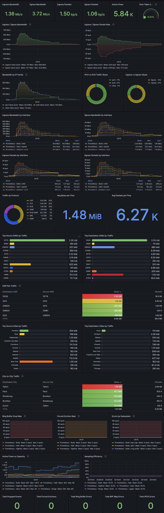
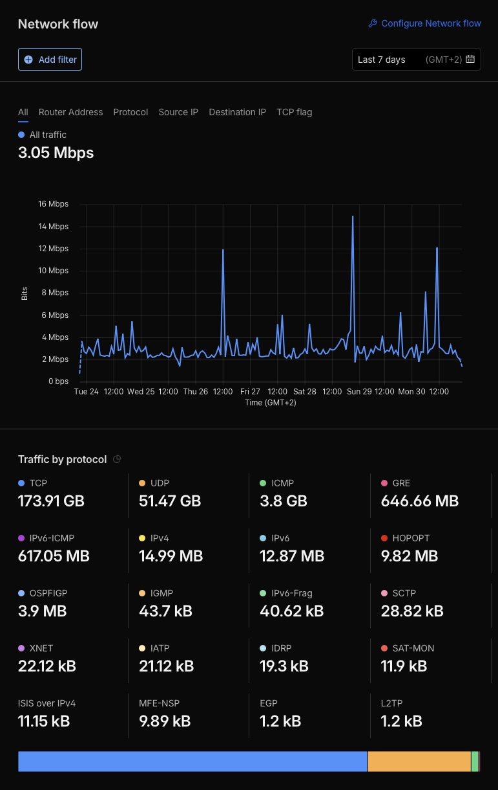

# RFM

Binary Cache:

- Cache: <https://cache.ysun.co>
- Key: `cache.ysun.co-1:WxPYwT5g3kt9XhUhHPpNLZKI9HIOsVVAuqSHpok8Qt4=`

RFM (Router Flow Monitor) is an eBPF-based network flow analysis agent for Linux
routers. It attaches TC programs to network interfaces, collects per-flow
traffic statistics with configurable sampling, optionally enriches flows from a
live BMP-fed RIB and/or MMDB ASN/city databases, and exports the results to
Prometheus and IPFIX.

Requirements:

- Linux 6.12 or newer ([integration tested](integration/versions.nix))
- Go 1.25+
- Root or `CAP_BPF` + `CAP_NET_ADMIN` + `CAP_PERFMON`

Current scope:

- Attaches TC programs for bidirectional flow observation (BPF behavior is
  config map driven and stateless)
- Counts wire packets and wire bytes, GRO and GSO super packets are unfolded
  from `gso_segs` so the counters match the NIC statistics
- Parses IPv4 and IPv6 traffic on ethernet, VLAN, and QinQ links
- Attaches interfaces as they appear and detaches them as they go, keeps the
  counters across restarts when pinned in bpffs
- Optionally enriches flows in userspace with BMP/RIB data, MMDB data, or both,
  the MMDB files are re-opened when an updater replaces them
- Exports Prometheus metrics, gauges over the live table and monotonic counters
  per label tuple
- Optionally exports flows to one UDP IPFIX collector, on eviction and as
  interval records on an active timeout, from a bounded queue that packs records
  into sized messages
- Changes the sample rate at runtime, by hand or adaptively when the ring buffer
  drops events
- Unix socket control plane with birdc style subcommands
- NixOS module and VM tests

Planned:

- XDP firewall fast path features?

RFM daemon (`rfm agent`) loads eBPF programs, collects flow events in userspace,
and serves Prometheus metrics over HTTP.

```
+------------------------------------+
|            kernel                  |
|  TC ingress --+                    |
|               +---> ring buffer -----> userspace collector
|  TC egress  --+                    |
|                                    |
|  per CPU iface stats map ------------> Prometheus /metrics
+------------------------------------+
```

BPF programs are loaded via TCX as link-based attachments. Programs are state
machine and reacts to the config map and reacts to the config map (e.g. sampling
rates and feature flags live in a shared `rfm_config` map rather than compiled
time constants).

### Data path

1. TC programs classify each packet by direction, protocol family, and 5-tuple
   after ethernet, VLAN, and QinQ parsing. Every packet updates per-CPU
   interface counters. GRO on ingress and GSO on egress hand the hook one skb
   that stands for several wire packets, so the program adds `gso_segs` packets
   and the header bytes the merge removed, which keeps the counters equal to the
   NIC statistics. Sampled packets (1-in-N) emit a flow event to a ring buffer
   carrying the same wire packet and byte counts. IPv4 non-initial fragments
   keep the IP protocol but export `src_port=0` and `dst_port=0` because later
   fragments do not carry the transport header.
2. The userspace collector reads events from the ring buffer in batches,
   converts `CLOCK_BOOTTIME` timestamps to wall clock, scales each event by the
   sample rate that was in force when it was sampled, and aggregates flows into
   an in-memory table keyed by
   `(ifindex, direction, protocol,
   src/dst address, src/dst port)`.
   Enrichment labels are resolved once when a flow is created and ride along
   with it.
3. Flows are evicted after a configurable idle timeout. Under high load, when
   the flow table is full, the flow with the oldest last-seen timestamp is
   forcibly evicted. A flow that keeps going is exported as an interval record
   every `active_timeout` while it stays in the table.
4. At scrape time, Prometheus exporter reads the BPF interface counters map
   directly, iterates the flow table for the gauges, and emits monotonic
   counters per interface, direction, protocol, and enrichment labels (ASN,
   city) that never reset when flows are evicted. With no enrichment configured,
   those labels stay empty and the agent still runs normally.
5. When IPFIX is enabled, flow records are queued for a sender that packs them
   into messages no larger than `max_message_size`, refreshes templates, and
   sends. Every record carries the packets and bytes since the previous record
   of the same flow. The socket is dialed lazily and re-dialed with backoff, so
   the agent starts before its bind address exists. The exporter excludes only
   its own socket tuple from recursive self-export.
6. When a control socket is configured, `rfm status`, `rfm flows`, `rfm rib`,
   `rfm set`, `rfm config` and `rfm reload` talk to the running agent.

## Configuration

RFM reads a TOML config file (default `/etc/rfm/rfm.toml`). Unknown keys are
rejected at load time. Example:

```toml
[agent]
interfaces = ["eth0", "tailscale0"]

[agent.bpf]
sample_rate = 100
ring_buf_size = 262144
wakeup_batch = 64
adaptive_sampling = false
max_sample_rate = 1000
pin_path = "/sys/fs/bpf/rfm"

[agent.collector]
max_flows = 65536
eviction_timeout = "30s"
active_timeout = "60s"

[agent.ipfix]
host = "127.0.0.1"
port = 4739
template_refresh = "60s"
observation_domain_id = 1
queue_size = 4096
flush_interval = "1s"
max_message_size = 1200

[agent.control]
socket = "/run/rfm/rfm.sock"

[agent.ipfix.bind]
host = "192.0.2.10"
port = 0

[agent.prometheus]
host = "::1"
port = 9669

[agent.enrich.mmdb]
asn_db = "/var/lib/rfm/dbip-asn-lite.mmdb"
city_db = "/var/lib/rfm/dbip-city-lite.mmdb"

[agent.enrich.rib.bmp]
host = "127.0.0.1"
port = 11019
```

### `agent`

`interfaces` (required, list of strings): Network interfaces to attach BPF
programs to. Each entry is a Go regex matched against system interface names
with implicit full-string anchoring. Use `[".*"]` for every interface,
`["ranet.*"]` for the ranet prefix, or list exact names like
`["eth0", "wlan0"]`.

Patterns may overlap. For example `["eth0", "eth.*"]` matches `eth0` once even
though both patterns apply, and a TC program is attached at most once per
interface. Resolution walks the system interface list once, evaluates each
pattern against each name, and deduplicates by interface index.

Startup fails when no interface matches any pattern. A pattern that fails to
compile as a regex is rejected at config load.

### `agent.bpf`

`sample_rate` (uint32, default 100): Sample 1 in every N packets for flow
events. Must be greater than 0. A value of 1 samples every packet. Higher values
reduce ring buffer throughput at the cost of flow granularity.

`ring_buf_size` (int, default 262144): Size of the BPF ring buffer in bytes.
Must be greater than 0, a power of two, and a multiple of the page size. Invalid
values are rejected at config load time. Larger buffers reduce the chance of
dropped events under burst traffic.

`wakeup_batch` (uint32, default 64): The BPF program flags ring buffer submits
with `BPF_RB_NO_WAKEUP` and forces a wakeup once every N submits. Lower values
reduce flow event delivery latency at the cost of more userspace wakeups. Higher
values amortize wakeups but make iterations longer (slower to react to events).
Must be greater than 0.

`iface_stats_size` (int, default 0): Override the BPF iface stats hash map
capacity. `0` means auto-compute as `max(len(interfaces) * 8, 64)`. Set
explicitly when running on a router with many subinterfaces or known high
cardinality where the auto-compute is too small.

`adaptive_sampling` (bool, default false): Let the collector raise the sample
rate while the ring buffer drops events and lower it again after ten quiet
sweeps. Every event is scaled by the rate that sampled it, and IPFIX records
carry the effective `samplingProbability`, so estimates stay unbiased. Leave it
off when the collector applies its own fixed sampling rate.

`max_sample_rate` (uint32, default 1000): Upper bound for the adaptive rate.
Must be at least `sample_rate`.

`pin_path` (string, default ""): A bpffs directory where the interface counters
are pinned. A restart or upgrade reuses the pinned map, so the counters stay
monotonic across it. The NixOS module sets `/sys/fs/bpf/rfm`. Empty keeps the
map private to the process.

### `agent.collector`

`max_flows` (int, default 65536): Maximum number of active flows held in memory.
Must be >= 0. When the table is full, the oldest flow is forcibly evicted. A
value of 0 means unlimited.

`eviction_timeout` (string, default "30s"): How long a flow can be idle before
eviction. Accepts any Go duration string (e.g. "10s", "1m", "2s"). Minimum value
is 1s.

`active_timeout` (string, default "60s"): How often a flow that keeps seeing
traffic is exported over IPFIX as an interval record (flowEndReason 0x02) while
it stays in the table. Each record carries the packets and bytes since the
previous record, so a collector sums them. `"0s"` disables it, otherwise the
minimum is 1s.

### `agent.ipfix`

`host` (string, default ""): Collector host for UDP IPFIX export. If
`agent.ipfix.host` and `agent.ipfix.port` are both unset, IPFIX export stays
disabled.

`port` (int, default 0): Collector UDP port for IPFIX export. If only one IPFIX
field is set, the other defaults to `::1` or `4739`.

`bind.host` (string, default ""): Local source address for the exporter UDP
socket. When unset, the kernel picks the source address from routing.

`bind.port` (int, default 0): Local source port for the exporter UDP socket. `0`
keeps the current behavior and uses an ephemeral port chosen by the kernel.

`template_refresh` (string, default "60s"): How often UDP IPFIX templates are
re-sent. Accepts any Go duration string. Minimum 1s. RFC 7011 requires UDP
exporters to re-send templates regularly because the transport is lossy. The
default of 60s lets a collector that loses or restarts during a packet recover
within one refresh window.

`observation_domain_id` (uint32, default 1): IPFIX observation domain id placed
in exported message headers. Must be > 0. Set distinct values when multiple RFM
agents export to one collector and downstream needs to demultiplex by source.

`queue_size` (int, default 0): Records that may wait for the sender goroutine.
`0` means `max_flows` or 4096, whichever is larger, so one eviction sweep of a
full table always fits. A full queue drops the newest record and counts it, so a
slow socket never stalls flow collection.

`flush_interval` (string, default "1s"): How long the sender gathers records
before a partial message goes out. Minimum 10ms.

`max_message_size` (int, default 1200): Largest IPFIX message in bytes, between
128 and 65535. Keep it under the path MTU, including any tunnel the exporter
traffic crosses, so messages never fragment.

The exporter dials the collector lazily and retries with backoff (1s to 30s), so
the agent starts and keeps counting while the collector or the local bind
address is unavailable. Send errors are counted by errno in
`rfm_ipfix_send_errors_total`. A full host conntrack table shows up there as
`EPERM`, add a `notrack` rule for the exporter tuple when that happens.

### `agent.prometheus`

`host` (string, default "::1"): Address to bind the Prometheus metrics HTTP
server to. Use "::1" to restrict to local IPv6 loopback, "127.0.0.1" for local
IPv4 only, "::" for all interfaces, or "0.0.0.0" for all IPv4 interfaces.

`port` (int, default 9669): TCP port for the metrics server. Must be between 1
and 65535.

### `agent.control`

`socket` (string, default ""): Path of the unix socket the `rfm` command line
talks to. Empty disables the control plane. The socket is created with mode 0600
for the agent's user, so run the commands as that user or as root. The NixOS
module sets `/run/rfm/rfm.sock`.

### `agent.enrich`

All enrichment backends are optional. If `agent.enrich` is omitted, the agent
still starts and `src_asn`, `dst_asn`, `src_city`, and `dst_city` stay empty.

`mmdb.asn_db` (string, default ""): Path to an ASN MMDB database. Startup fails
early if the configured path is missing or unreadable.

`mmdb.city_db` (string, default ""): Path to a city MMDB database. Startup fails
early if the configured path is missing or unreadable.

`rib.bmp.host` (string, default ""): BMP listen host for live route updates. If
`rib.bmp.host` and `rib.bmp.port` are both unset, the BMP listener stays
disabled.

`rib.bmp.port` (int, default 0): BMP listen port for live route updates. If only
one BMP field is set, the other defaults to `::1` or `11019`.

If configured with no BMP peer connected yet, the agent still runs and ASN
labels stay empty until routes arrive.

When both backends are enabled, ASN lookup uses the RIB first and MMDB as a
fallback. City lookup comes from MMDB. Labels are resolved once when a flow is
created.

MMDB files are polled once a minute and re-opened when their size or mtime
changed, so an updater that replaces the file (geoipupdate) takes effect without
a restart. `rfm reload mmdb` forces the check.

The RIB keeps every route per BMP peer, serves the best one per prefix (post
policy over pre policy, then the lowest peer address), withdraws a peer's routes
on Peer Down, and replaces them when a new session announces the peer again with
Peer Up, since the speaker dumps the peer's table right after. Routes survive
the end of a session, so a speaker restart keeps enrichment in place until the
next dump. A route whose AS path ends in an AS_SET has no single origin and
reports ASN 0.

## Prometheus metrics

Interface counters (from BPF per-CPU hash map, updated in kernel). The `family`
label is `"ipv4"`, `"ipv6"`, or `"other"` for non-IP traffic (e.g. ARP):

- `rfm_interface_rx_bytes_total{ifname, family}`
- `rfm_interface_tx_bytes_total{ifname, family}`
- `rfm_interface_rx_packets_total{ifname, family}`
- `rfm_interface_tx_packets_total{ifname, family}`

Flow gauges over the live flow table (rolled up by enrichment labels):

- `rfm_flow_bytes{ifname, direction, proto, src_asn, dst_asn, src_city, dst_city}`
- `rfm_flow_packets{ifname, direction, proto, src_asn, dst_asn, src_city, dst_city}`
- `rfm_flow_sampled_bytes{ifname, direction, proto, src_asn, dst_asn, src_city, dst_city}`
- `rfm_flow_sampled_packets{ifname, direction, proto, src_asn, dst_asn, src_city, dst_city}`

Flow counters with the same labels, which never reset when flows are evicted and
therefore work with `rate()` and `increase()`:

- `rfm_flow_bytes_total`
- `rfm_flow_packets_total`
- `rfm_flow_sampled_bytes_total`
- `rfm_flow_sampled_packets_total`

`rfm_flow_bytes` and `rfm_flow_bytes_total` are estimates, every event scaled by
the sample rate in force when it was sampled. The `sampled` variants are the raw
sampled values before scaling. `increase(rfm_flow_bytes_total[1h])` over
`increase(rfm_interface_rx_bytes_total[1h])` is the sampling error in
production. A label tuple that saw no traffic for ten eviction timeouts leaves
the scrape.

Sampling:

- `rfm_bpf_sample_rate`

Collector health:

- `rfm_collector_active_flows`
- `rfm_collector_dropped_events_total`
- `rfm_collector_forced_evictions_total`
- `rfm_errors_total{subsystem}`

`rfm_errors_total{subsystem}` currently uses `bpf_map`, `ring_buffer`, and
`ipfix`. The `ipfix` value sums queue refusals, unsent records, dial errors and
send errors.

IPFIX exporter:

- `rfm_ipfix_connected`
- `rfm_ipfix_dials_total`
- `rfm_ipfix_dial_errors_total`
- `rfm_ipfix_messages_total`
- `rfm_ipfix_records_total`
- `rfm_ipfix_dropped_records_total{reason}` with `queue_full`, `unconnected`,
  `encode`
- `rfm_ipfix_send_errors_total{errno}`

Go process and runtime metrics (`process_*`, `go_*`) are exported too.

## Visualization

An early Grafana dashboard is included at `grafana/dashboard.json`.



Screenshot from
[Cloudflare Network Flow](https://developers.cloudflare.com/network-flow/)
(free):



The provided dashboard example is intentionally a starting point, not a finished
observability product. The current dashboard covers the basic operational views:

- aggregate ingress and egress traffic
- per-interface traffic breakdown
- protocol share
- ASN and city summaries
- collector health and error panels

The exporter already exposes enough structure to build more visualizations than
the bundled dashboard currently shows. The shipped dashboard should be treated
as a reference layout for the current metric set, not as the limit of what can
be derived from RFM data in Grafana.

## CLI

`rfm agent` runs the daemon. The other subcommands talk to a running agent over
its control socket (`--socket`, default `/run/rfm/rfm.sock`) and print tables,
or JSON with `--json`:

- `rfm status`: version, uptime, attached interfaces, sample rate, flow table,
  IPFIX, MMDB and RIB state
- `rfm flows top [N] [--by bytes|packets]`: the busiest live flows
- `rfm flows count`: live flow count
- `rfm rib lookup <address>`: best route with AS path, communities and peer
- `rfm rib summary`: prefixes, routes and peers in the RIB
- `rfm set sample-rate <N>`: sample 1 in N packets from now on, without a
  restart, estimates stay consistent because every event is scaled by the rate
  that sampled it
- `rfm config show`: the configuration file the agent loaded
- `rfm reload mmdb`: re-open replaced MMDB files now

Example:

```
$ sudo rfm status
version     2026.902.0
uptime      3h12m0s
interfaces  eth0
sampling    1 in 10
flows       612 active of 65536, 0 ring drops, 0 forced evictions
ipfix       162.159.65.1:2055 connected, 1843 messages, 27510 records, 0 queue drops, 0 unsent
mmdb        asn 2026-08-29, city 2026-08-29
```

## NixOS module

Example:

```nix
{ pkgs, ... }:

{
  services.rfm = {
    enable = true;

    settings.agent = {
      interfaces = [ "eth0" "tailscale0" ];
      bpf.sample_rate = 50;
      ipfix.host = "127.0.0.1";
      ipfix.port = 4739;
      prometheus.port = 9669;
      enrich.mmdb.asn_db = "${pkgs.dbip-asn-lite}/share/dbip/dbip-asn-lite.mmdb";
      enrich.mmdb.city_db = "${pkgs.dbip-city-lite}/share/dbip/dbip-city-lite.mmdb";
      enrich.rib.bmp.host = "127.0.0.1";
      enrich.rib.bmp.port = 11019;
    };
  };
}
```

The module generates a TOML config file and runs RFM as a systemd service with
automatic restart on failure. All supported knobs are available through (typed)
module options.

The service runs as the `rfm` system user with `CAP_BPF`, `CAP_NET_ADMIN` and
`CAP_PERFMON` as ambient capabilities and a read-only view of the system. The
module sets the control socket to `/run/rfm/rfm.sock` and pins the interface
counters under `/sys/fs/bpf/rfm`, which it creates for that user. MMDB files
must be readable by the `rfm` user, the geoipupdate module's database directory
is.

## Scope

RFM is a lightweight flow telemetry agent, not a full traffic analysis platform.
A few deliberate choices follow from that:

The BPF programs capture only the fields needed for basic flow identification:
IP addresses, L4 ports, protocol number, interface, direction, and packet
length. They do not extract TCP flags, ToS/DSCP, TTL, IPv6 flow labels, or ICMP
type/code. Adding these fields would widen the per-event wire struct, increase
ring buffer pressure, and expand the IPFIX template surface for information that
most lightweight deployments never query. Operators who need TCP flag analysis,
QoS-aware accounting, or deep header inspection should consider ntopng or pmacct
(or other solutions) instead.

Prometheus flow gauges only includes (intentionally) enrichment labels
(interface, direction, protocol, ASN, city). Source and destination ports are
not included as Prometheus labels. With `max_flows` defaulting to 65536 and
ephemeral source ports ranging from 32768 to 60999, adding port labels would
create maybe 10k+ unique time series per scrape interval, most of which are seen
once and never again. This kind of high cardinality churn is expensive for
Prometheus to ingest and store. Port level flow records are available through
IPFIX push path, where a downstream collector (goflow2 or similar, or flow
collector platforms with IPFIX support like Cloudflare Magic Network Monitoring)
is better suited to handle them.

## Comparison

The tools below all receive NetFlow/sFlow/IPFIX from routers, and some can also
capture packets directly (e.g. ntopng via libpcap/PF_RING, pmacct via pmacctd,
FastNetMon via AF_PACKET, nfdump via nfpcapd, etc.). RFM takes a different
approach, it captures packets directly in the kernel via eBPF TC programs.

| Tool                                                       | Type                       | Infrastructure                | BGP/BMP                       | License              |
| ---------------------------------------------------------- | -------------------------- | ----------------------------- | ----------------------------- | -------------------- |
| RFM                                                        | eBPF agent (single binary) | Prometheus                    | BMP (inline)                  | AGPLv3               |
| [Akvorado](https://github.com/akvorado/akvorado)           | Flow receiver              | Kafka + ClickHouse + Redis    | BMP; SNMP/gNMI for interfaces | AGPLv3               |
| [ElastiFlow](https://www.elastiflow.com)                   | Flow receiver              | ES, OpenSearch, Splunk, Kafka | GeoIP only                    | Proprietary          |
| [FastNetMon](https://github.com/pavel-odintsov/fastnetmon) | DDoS detection             | Prom, Kafka, ClickHouse       | BGP (output only)             | GPL-2.0 / commercial |
| [goflow2](https://github.com/netsampler/goflow2)           | Flow receiver              | Kafka or file                 | GeoIP only                    | BSD-3                |
| [kTranslate](https://github.com/kentik/ktranslate)         | Flow receiver              | 14+ output sinks              | GeoIP only                    | Apache-2.0           |
| [nfdump](https://github.com/phaag/nfdump)                  | Flow receiver + CLI        | Flat files                    | GeoIP only                    | BSD                  |
| [ntopng](https://github.com/ntop/ntopng)                   | Packet capture + DPI       | Redis + optional DB           | None                          | GPLv3 / commercial   |
| [pmacct](https://github.com/pmacct/pmacct)                 | Multi-daemon suite         | Kafka, PG, MySQL              | BGP + BMP + RPKI              | GPLv2+               |

The main goal of RFM is to be a extremely lightweight and easily configurable
flow analytics tool. There are no external dependencies at runtime (unlike other
solutions, it does not require a separate database, message queue, Redis, web
server beyond the built-in Prometheus endpoint). Typical RSS is around 10 MB.

Most alternatives require significant supporting infrastructure:

- **Akvorado**: Kafka + ClickHouse + Redis, four internal services (inlet,
  outlet, orchestrator, console)
- **ntopng**: Redis, optionally Elasticsearch or ClickHouse, nProbe (separate
  commercial product) for NetFlow/sFlow collection
- **pmacct**: seven daemons (pmacctd, nfacctd, sfacctd, uacctd, pmbgpd, pmbmpd,
  pmtelemetryd) each with its own config file and output plugins
- **ElastiFlow**: Elasticsearch or OpenSearch cluster

Even the lighter tools in the comparison (goflow2, nfdump, kTranslate) are flow
receivers that need routers to be configured for NetFlow/sFlow export and
typically feed into a downstream pipeline for storage and visualization.

### Performance

RFM's eBPF TC programs run in the kernel with zero-copy delivery to userspace
via a ring buffer. Packet sampling (configurable 1-in-N) reduces ring buffer
throughput. Interface counters are updated on every packet regardless of
sampling with no userspace involvement. The Prometheus exporter reads the BPF
map directly at scrape time.

Compared to libpcap based tools (ntopng, pmacctd), eBPF TC avoids the overhead
of copying every packet to userspace. RFM only copies sampled flow metadata not
the full packet contents. Compared to flow receivers (Akvorado, goflow2), RFM
eliminates the intermediate UDP export step entirely.

Performance under sustained high packet rates depends on the sample rate, ring
buffer size, and flow table limits, all of which are tunable.

### Container and Kubernetes use

RFM can run inside Docker containers or Kubernetes pods with `CAP_BPF` +
`CAP_NET_ADMIN` + `CAP_PERFMON` (or privileged mode). The host kernel must be
Linux 6.12+.

Most flow receivers (Akvorado, goflow2, nfdump, ElastiFlow) cannot do
per-container flow monitoring. eBPF tools that can monitor per-container traffic
are either tied to a specific CNI (Cilium Hubble requires Cilium, Calico flow
logs require Calico) or target broader Kubernetes observability (Microsoft
Retina is CNI agnostic but is a larger platform).

RFM is CNI agnostic and does not require any particular network plugin. It
attaches TC programs to whatever interfaces are available in its network
namespace. This makes it usable as:

- a **DaemonSet** on each node (with host networking), attaching to container
  veth interfaces on the host side
- a **sidecar** inside a pod, monitoring that pod's network interfaces directly

The DaemonSet pattern is standard for eBPF-based monitoring (used by Hubble,
Retina, and Calico), but RFM's small footprint also makes the sidecar model
practical where per-pod isolation is needed.

## Sponsorship disclaimer

[](https://netactuate.com)

This project is generously supported and tested on infrastructure provided by
[NetActuate](https://netactuate.com). The views and content of this project are
solely those of the authors and do not imply endorsement by NetActuate.
NetActuate provides global bare metal and cloud infrastructure with a strong
focus on performance, reliability, and geographic reach. Their platform enables
rapid deployment across diverse regions, making it well suited for
network-intensive and distributed systems workloads.

## Upstream contribution

- BIRD Report 1:
  <https://trubka.network.cz/archives/list/bird-users@network.cz/message/5BLB2ISGTARLUWDT3O42K6PV5HOMHSTU/>
  Fix:
  <https://github.com/CZ-NIC/bird/commit/e038bf69ec11c46a76634918129bb05583730506>

- BIRD Report 2:
  <https://trubka.network.cz/archives/list/bird-users@network.cz/message/6QMZAPPD6VDNJSRAS2MHHVT6E5V6IKHB/>
  Fix:
  <https://github.com/CZ-NIC/bird/commit/371531d20e251d16916450338dc034fb2b1a7240>

- BIRD Report 3:
  <https://trubka.network.cz/archives/list/bird-users@network.cz/message/XN43FORRZGU2RL3TASCE6NDKWPTZTSAC/>

## License

Source files under `bpf/` are licensed under GPLv2 to satisfy kernel BPF
requirements. Everything else is AGPLv3.
